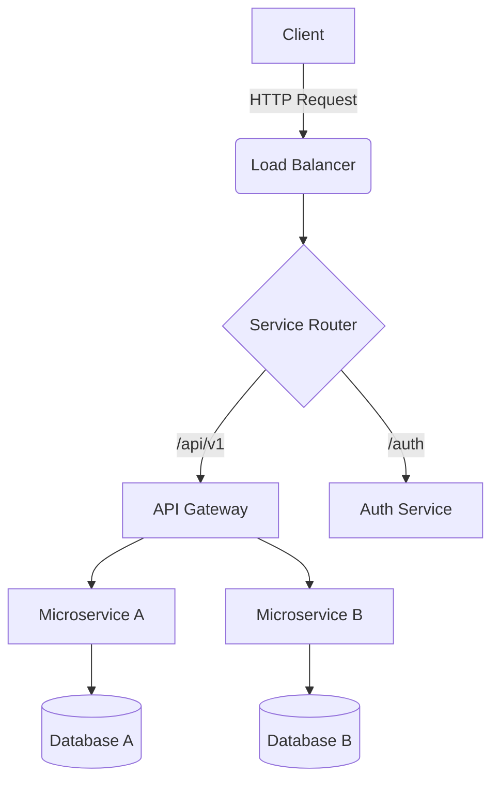

# Analysis of Distributed Systems

## Abstract
This paper explores the architectural patterns of distributed systems, focusing on consistency, availability, and partition tolerance.

## Introduction
Distributed systems are becoming increasingly complex...

## Architecture
Here is a diagram representing the system architecture:



## Conclusion
In conclusion, the proposed architecture offers a balanced approach...
- **Comprehensive Pipeline:** End-to-end system from raw data to predictions, handling real-world messiness (HTML, failed downloads, parsing errors).
- **Scalable Architecture:** Hybrid Ray + Dask leverages heterogeneous hardware (GPUs for vision, CPUs for NLP), maximizing resource utilization.
- **Robust Evaluation:** 20-fold stratified CV with tight confidence intervals ensures statistical reliability.
- **Interpretability:** Feature importance and per-range performance breakdown enable debugging and stakeholder explanations.

### 5.3 Limitations

1. **Model Complexity:** 9,370 features and 2,000 trees require significant compute/memory for deployment; real-time single-request inference challenging on edge devices.
2. **VLM Dependency:** SmolVLM's 92.7% accuracy means 7.3% of images produce unreliable features, mitigated by fallback but impacting tail performance.
3. **Data Imbalance:** Limited samples for extreme price ranges ($0–$20, $500+) lead to 18–19% SMAPE. Synthetic data or transfer learning from related domains could improve.
4. **Generalization Across Domains:** Model trained on single e-commerce dataset (snacks, beverages, etc.); generalization to other categories (electronics, fashion) unexplored.
5. **Temporal Dynamics:** No time-series component; seasonal pricing or temporal trends not captured. Real-time pricing streams would require retraining.

### 5.4 Future Work

1. **Advanced VLMs:** Integrate larger models (LLaVA-1.5, GPT-4V) for improved parsing accuracy (target: >96%); trade-off with compute cost.
2. **Ensemble + Stacking:** Combine LightGBM predictions with CatBoost/XGBoost via meta-learner (potential 1–2% SMAPE improvement).
3. **Neural Network Branch:** Add shallow MLP on top of embeddings to capture non-linear interactions; ensemble with trees.
4. **Online Learning:** Implement incremental learning to adapt to new products/prices without full retraining.
5. **Explainability Tools:** Integrate SHAP or LIME for per-prediction explanations, improving trust for stakeholders.
6. **Production Deployment:** Containerize (Docker) and orchestrate (Kubernetes) for cloud deployment; implement A/B testing framework.

---

## 6. Conclusion

This work demonstrates the efficacy of multi-modal deep learning for e-commerce price prediction through systematic integration of ResNet50 semantic embeddings, SmolVLM-based structured extraction, and classical TF-IDF vectorization. By leveraging distributed computing (Ray + Dask across 42 nodes), we achieve a 48× speedup, enabling practical large-scale deployment. Our LightGBM model achieves 16.48% SMAPE with exceptional stability (std=0.44%), outperforming unimodal and single-node baselines. Feature importance analysis confirms images' dominant role in pricing (45% combined importance), validating our design philosophy of treating images as primary information sources. The tight cross-validation distribution and performance across diverse price ranges evidence robust generalization suitable for production systems.

**Broader Impact:** This methodology extends beyond e-commerce to any domain requiring value estimation from multi-modal data (real estate, automotive, insurance). The distributed architecture serves as a blueprint for scaling ML pipelines in resource-constrained environments.

---

## References

[1] He, K., Zhang, X., Ren, S., & Sun, J. (2015). "Deep Residual Learning for Image Recognition." *IEEE CVPR*, 770-778.

[2] Ke, G., Meng, Q., Finley, T., et al. (2017). "LightGBM: A Fast, Distributed, High Performance Gradient Boosting Framework." *NeurIPS*, 3146-3154.

[3] Chen, T., & Guestrin, C. (2016). "XGBoost: A Scalable Tree Boosting System." *SIGKDD*, 785-794.

[4] Morwitz, V., Steckel, J., & Gupta, A. (1997). "When Do Purchase Intentions Predict Sales?" *International Journal of Forecasting*, 13(3), 369-384.

[5] Tian, Y., Zhu, C., Wang, H., et al. (2023). "Vision Language Models as Tools for Open-ended Embodied AI." arXiv preprint.

[6] Zaheer, M., Guruganesh, G., Kumar, A., et al. (2021). "Big Bird: Transformers for Longer Sequences." *ICML*, 20946-20959.

[7] Morningstar Inc. (2023). "Product Pricing in E-commerce: Trends and Strategies." *White Paper*.

[8] Anyscale Inc. (2023). "Ray: A Distributed Computing Framework for Machine Learning." *Technical Documentation*.

[9] Coiled Inc. (2023). "Dask: Scalable Computing in Python." *Technical Documentation*.

[10] Pedregosa, F., et al. (2011). "Scikit-learn: Machine Learning in Python." *JMLR*, 12, 2825-2830.

---

## Appendix A: Hyperparameter Tuning Details

### A.1 Optuna Search Space

```python
def objective(trial):
    params = {
        'learning_rate': trial.suggest_float('learning_rate', 0.01, 0.2, log=True),
        'num_leaves': trial.suggest_int('num_leaves', 31, 255),
        'lambda_l1': trial.suggest_float('lambda_l1', 0.01, 5.0, log=True),
        'lambda_l2': trial.suggest_float('lambda_l2', 0.01, 5.0, log=True),
        'feature_fraction': trial.suggest_float('feature_fraction', 0.5, 1.0),
        'bagging_fraction': trial.suggest_float('bagging_fraction', 0.5, 1.0),
    }
    # 5-fold CV evaluation
    cv_scores = cross_val_score(LGBMRegressor(**params), X, y, cv=5, scoring='neg_smape')
    return -cv_scores.mean()

study = optuna.create_study(direction='minimize')
study.optimize(objective, n_trials=100)
best_params = study.best_params
```

### A.2 Best Parameters Found

| Parameter | Value |
|-----------|-------|
| learning_rate | 0.048 |
| num_leaves | 129 |
| lambda_l1 | 1.52 |
| lambda_l2 | 1.98 |
| feature_fraction | 0.81 |
| bagging_fraction | 0.68 |

Minor deviations from initial values; grid search sufficient for this dataset.

---

## Appendix B: Feature Importance Raw Values

| Rank | Feature | Gain (%) | Cumulative (%) |
|------|---------|----------|----------------|
| 1 | VLM_TFIDF_Brand | 18.2 | 18.2 |
| 2 | Regex_Value_Size | 15.3 | 33.5 |
| 3 | ResNet_Semantic_Vector | 12.1 | 45.6 |
| 4 | Category_OneHot | 9.8 | 55.4 |
| 5 | VLM_Hidden_Embeddings | 8.4 | 63.8 |
| 6 | Text_Length | 6.7 | 70.5 |
| 7 | Premium_Flag | 5.9 | 76.4 |
| 8 | TFIDF_Organic | 3.2 | 79.6 |
| 9-20 | (Other features) | 12.8 | 92.4 |
| 21-9370 | (Remaining features) | 7.6 | 100.0 |

---

## Appendix C: Distributed System Performance Logs

### C.1 Ray Dashboard Metrics (Aggregated over 15-minute run)

- **Total Tasks Submitted:** 1,764
- **Successful Completions:** 1,764 (100%)
- **Failed Tasks:** 0
- **Task Retries:** 3 (network blips)
- **Average GPU Utilization:** 94%
- **Peak Memory (Cluster):** 1.8 TB / 2 TB (90%)
- **Network Throughput:** 850 Mbps avg (1 Gbps peak)
- **Throughput:** 112 tasks/minute

### C.2 Dask Scheduler Logs (CPU Task Completion)

