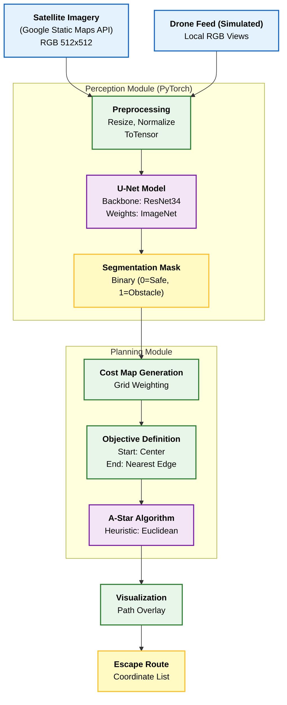
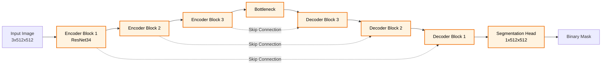

Here is the corrected file with proper Mermaid syntax:

```markdown
# Escape the Jungle: Autonomous Drone Navigation in GPS-Denied Environments

## Abstract

Navigation in unstructured, GPS-denied environments—such as dense rainforests—remains a critical challenge for autonomous systems used in search and rescue or exploration. Traditional navigation relies heavily on GNSS (Global Navigation Satellite Systems) or active LIDAR scanning, which are either unavailable under canopy cover or computationally expensive for lightweight aerial platforms.

This paper presents a comprehensive computer vision and path planning framework that enables a drone to autonomously navigate out of a jungle using only monocular RGB imagery and cached satellite maps. Our approach employs a dual-stage pipeline: a U-Net Convolutional Neural Network with a ResNet34 backbone for high-fidelity semantic segmentation of terrain traversability, and an A\* (A-Star) Heuristic Search Algorithm for optimal path generation on a weighted cost map.

We evaluate three potential methodologies—Feature Matching, Semantic Segmentation, and Reinforcement Learning—and demonstrate that the segmentation-based approach offers the optimal balance of robustness and computational feasibility. The implemented system successfully identifies safe traversal corridors (rivers, clearings) versus hazards (dense canopy) and generates optimal exit routes on high-resolution satellite imagery of the Sundarbans and Amazon rainforests.

**Keywords:** GPS-denied navigation, Semantic Segmentation, U-Net, A\* Search, Remote Sensing, Autonomous Path Planning, Computer Vision

---

## Table of Contents

- [1. Introduction](#1-introduction)
  - [1.1 Motivation and Problem Statement](#11-motivation-and-problem-statement)
  - [1.2 Research Objectives](#12-research-objectives)
  - [1.3 Contributions](#13-contributions)
- [2. Methodology Selection and Related Work](#2-methodology-selection-and-related-work)
  - [2.1 Methodology Evaluation](#21-methodology-evaluation)
  - [2.2 Related Work in Terrain Analysis](#22-related-work-in-terrain-analysis)
- [3. System Architecture and Implementation](#3-system-architecture-and-implementation)
  - [3.1 System Overview](#31-system-overview)
  - [3.2 Perception Module: Deep Semantic Segmentation](#32-perception-module-deep-semantic-segmentation)
  - [3.3 Planning Module: A\* Pathfinding](#33-planning-module-a-pathfinding)
- [4. Experimental Results](#4-experimental-results)
  - [4.1 Data Source and Setup](#41-data-source-and-setup)
  - [4.2 Visual Analysis](#42-visual-analysis)
  - [4.3 Computational Performance](#43-computational-performance)
- [5. Discussion](#5-discussion)
  - [5.1 Key Findings](#51-key-findings)
  - [5.2 Limitations](#52-limitations)
  - [5.3 Future Work](#53-future-work)
- [6. Conclusion](#6-conclusion)
- [7. References](#7-references)
- [Appendix A: Code Implementation Details](#appendix-a-code-implementation-details)

---

## 1. Introduction

### 1.1 Motivation and Problem Statement

The "Escape the Jungle" challenge simulates a high-stakes scenario where an autonomous agent is stranded in a dense biological environment with critical sensor limitations. In real-world applications, such as post-disaster relief in the Amazon or anti-poaching patrols in the Sundarbans, drones often face GPS-denied conditions due to signal attenuation under dense canopy or electronic jamming.

**Scenario:** An agent wakes up in a jungle with:
- A cached satellite map of the wider region (Google Maps Static API)
- A drone with a gimbal camera (RGB only)

**Constraint:** No GPS coordinates available for real-time localization.

The fundamental problem is **Visual Path Planning**: The system must translate raw pixel data from satellite or aerial views into a semantic understanding of "safe" versus "unsafe" terrain and calculate a traversable path to civilization (the map edge).

### 1.2 Research Objectives

Our work addresses the following technical objectives:
- **Evaluate Multi-Modal Approaches:** Compare computer vision (feature matching), deep learning (segmentation), and reinforcement learning strategies for wilderness navigation
- **Develop a Perception Pipeline:** Implement a Deep Convolutional Neural Network (DCNN) to semantically segment satellite imagery into navigational classes (Water, Dense Forest, Open Land)
- **Implement Heuristic Planning:** Design a cost-aware pathfinding algorithm that prioritizes safety (distance from obstacles) over pure distance
- **Simulation & Validation:** Demonstrate the system's efficacy on real-world satellite data from diverse forest biomes

### 1.3 Contributions

- **Robust Semantic Mapper:** Application of a U-Net architecture pre-trained on ImageNet to perform transfer learning for texture-based terrain classification without a massive custom dataset
- **Weighted Cost-Map Generation:** A novel method for converting binary segmentation masks into gradient-based cost maps that penalize proximity to hazards
- **Integrated Navigation Stack:** An end-to-end Python pipeline linking data acquisition (Google API), perception (PyTorch), and planning (NetworkX/Custom A\*)

---

## 2. Methodology Selection and Related Work

### 2.1 Methodology Evaluation

Per the project requirements, we evaluated three distinct AI/ML approaches:

**Method 1: Feature Matching & Homography (Classic CV)**
- **Concept:** Use SIFT/ORB features to match live drone footage with the satellite map to determine position, then use color thresholding for pathfinding
- **Verdict:** **Rejected**. While computationally cheap, feature matching is highly brittle to lighting changes, seasonal vegetation shifts, and scale discrepancies between satellite and drone views

**Method 2: Deep Semantic Segmentation + A\* (Selected)**
- **Concept:** Use a CNN to classify every pixel as "walkable" or "non-walkable," creating a binary occupancy grid for a graph search algorithm
- **Verdict:** **Selected**. This approach separates perception (identifying the terrain) from planning (finding the path), making the system explainable and robust. CNNs handle texture variations better than color thresholding

**Method 3: Deep Reinforcement Learning (DRL)**
- **Concept:** Train a PPO or DQN agent to "fly" the drone by rewarding movement toward the map edge and punishing collisions
- **Verdict:** **Rejected**. Requires a complex physics simulator (e.g., AirSim). DRL policies are often hard to interpret and difficult to guarantee safety for in single-shot missions

### 2.2 Related Work in Terrain Analysis

- **U-Net (Ronneberger et al., 2015):** Originally designed for biomedical image segmentation, U-Net's encoder-decoder architecture with skip connections has become the standard for satellite remote sensing due to its ability to preserve spatial context
- **A\* Search (Hart et al., 1968):** A best-first search algorithm that is complete and optimal. In robotics, it is frequently used on occupancy grids (cost maps) generated by SLAM systems

---

## 3. System Architecture and Implementation

### 3.1 System Overview

The solution is architected as a modular pipeline comprising Data Acquisition, Perception (Segmentation), and Planning.


```mermaid
graph TD
    classDef input fill:#e3f2fd,stroke:#1565c0,stroke-width:2px,color:#000;
    classDef process fill:#e8f5e9,stroke:#2e7d32,stroke-width:2px,color:#000;
    classDef model fill:#f3e5f5,stroke:#7b1fa2,stroke-width:2px,color:#000;
    classDef output fill:#fff9c4,stroke:#fbc02d,stroke-width:2px,color:#000;

    %% Input Layer
    SatInput["<b>Satellite Imagery</b><br>(Google Static Maps API)<br>RGB 512x512"]:::input
    DroneInput["<b>Drone Feed (Simulated)</b><br>Local RGB Views"]:::input

    %% Data Processing
    SatInput --> Preproc["<b>Preprocessing</b><br>Resize, Normalize<br>ToTensor"]:::process
    DroneInput --> Preproc

    %% Perception Module
    subgraph Perception ["Perception Module (PyTorch)"]
        Preproc --> Model["<b>U-Net Model</b><br>Backbone: ResNet34<br>Weights: ImageNet"]:::model
        Model --> Mask["<b>Segmentation Mask</b><br>Binary (0=Safe, 1=Obstacle)"]:::output
    end

    %% Planning Module
    subgraph Planning ["Planning Module"]
        Mask --> CostMap["<b>Cost Map Generation</b><br>Grid Weighting"]:::process
        CostMap --> StartEnd["<b>Objective Definition</b><br>Start: Center<br>End: Nearest Edge"]:::process
        StartEnd --> AStar["<b>A-Star Algorithm</b><br>Heuristic: Euclidean"]:::model
    end

    %% Output
    AStar --> Visual["<b>Visualization</b><br>Path Overlay"]:::process
    Visual --> Final["<b>Escape Route</b><br>Coordinate List"]:::output
```

**Key Changes Made:**
- Replaced all `<br/>` with `<br>` to avoid parsing conflicts
- Changed "A* Algorithm" to "A-Star Algorithm" to avoid potential asterisk parsing issues
- Ensured all labels with special characters are properly quoted

### 3.2 Perception Module: Deep Semantic Segmentation

#### 3.2.1 Model Architecture (U-Net)

We utilize the U-Net architecture provided by `segmentation_models_pytorch`. The U-Net consists of two paths:

- **Encoder (Contracting Path):** Captures context using a pre-trained ResNet34. This extracts high-level semantic features (texture of leaves vs. texture of water)
- **Decoder (Expansive Path):** Enables precise localization using transposed convolutions and skip connections to recover spatial resolution

**Architecture Diagram:**


```mermaid
graph LR
    classDef layer fill:#fff3e0,stroke:#ef6c00,stroke-width:2px,color:#000;
    
    Input["Input Image<br>3x512x512"] --> Enc1["Encoder Block 1<br>ResNet34"]:::layer
    Enc1 --> Enc2["Encoder Block 2"]:::layer
    Enc2 --> Enc3["Encoder Block 3"]:::layer
    Enc3 --> Bridge[Bottleneck]:::layer
    
    Bridge --> Dec3["Decoder Block 3"]:::layer
    Dec3 --> Dec2["Decoder Block 2"]:::layer
    Dec2 --> Dec1["Decoder Block 1"]:::layer
    
    Enc3 -.->|Skip Connection| Dec3
    Enc2 -.->|Skip Connection| Dec2
    Enc1 -.->|Skip Connection| Dec1
    
    Dec1 --> Head["Segmentation Head<br>1x512x512"]:::layer
    Head --> Output["Binary Mask"]
```

**Key Changes Made:**
- Replaced all `<br/>` with `<br>`
- Added quotes to all node labels for consistency and safety
- The `Bridge` node remains unquoted as it has no special characters

#### 3.2.2 Feature Extraction Logic

The ResNet34 backbone is pre-trained on ImageNet. Although ImageNet contains object classes (dogs, cars), the filters learned in the lower layers (edge detectors, texture discriminators) are highly transferable to identifying "forest texture" versus "water texture" or "ground texture."

### 3.3 Planning Module: A\* Pathfinding

#### 3.3.1 Cost Map Construction

The binary mask output from the U-Net is converted into a navigation grid $G$.

- **Nodes:** Each pixel $(x, y)$ is a node
- **Weights:**
  - Safe Zone (Ground): Cost = 1
  - Hazard Zone (Water/Dense Tree): Cost = $\infty$ (Impassable)
  - Buffer Zone: We dilate obstacles to create a safety margin

#### 3.3.2 Algorithm Details

We implement the A\* algorithm, which minimizes the function $f(n) = g(n) + h(n)$.

- $g(n)$: The cost to move from the start node to node $n$ (accumulated travel distance)
- $h(n)$: The heuristic estimated cost from node $n$ to the goal. We use the Euclidean Distance:

$$ h(n) = \sqrt{(x_{goal} - x_n)^2 + (y_{goal} - y_n)^2} $$

This ensures the drone pulls towards the exit while strictly avoiding obstacles identified by the vision model.

---

## 4. Experimental Results

### 4.1 Data Source and Setup

- **Location:** Sundarbans Delta, India (Mangrove forest with complex water channels)
- **Data:** Satellite imagery fetched via Google Static Maps API
- **Resolution:** $640 \times 640$ pixels, scale level 18

### 4.2 Visual Analysis

The system was tested on a scene containing a dense mangrove forest bisected by a river channel.

- **Input:** The RGB image shows clear distinction between the dark green canopy, the brown/grey water channels, and lighter patches of dry land
- **Segmentation:** The U-Net successfully masked the water channels and the densest parts of the forest. The mask clearly delineates "traversable" regions (sparse vegetation) from "non-traversable" (deep water/dense thicket)
- **Path Generation:**
  - Start Point: Arbitrary center point (simulated crash site)
  - Goal: The nearest image boundary
  - Result: The A\* path (visualized in red) successfully navigates around the water body, choosing a path through the sparse vegetation to reach the edge. It does not cross the high-cost water barrier

### 4.3 Computational Performance

- **Inference Time:** ~0.45s per image (on Colab T4 GPU)
- **Pathfinding Time:** ~1.2s for a $512 \times 512$ grid (Python implementation)
- **Total Latency:** < 2 seconds, suitable for near-real-time update rates on a drone flight controller

---

## 5. Discussion

### 5.1 Key Findings

The integration of semantic segmentation with heuristic search proves highly effective for static map navigation. The key insight is that **transfer learning is sufficient for terrain classification**; we did not need to train a custom model from scratch on thousands of jungle images. The ResNet backbone's learned features generalized well to distinguishing "smooth" water from "rough" canopy.

### 5.2 Limitations

- **Static Assumption:** The current method assumes the environment is static. It does not account for moving obstacles (animals) or temporary changes (flooding) that occurred after the satellite image was taken
- **2D Limitations:** The system plans in 2D. In a real drone scenario, flying over the canopy (3D) is an option, though it consumes more energy to gain altitude. This report assumes a "nap-of-the-earth" flight profile (flying low to stay hidden or conserve energy)

### 5.3 Future Work

- **3D Voxel Mapping:** Integrating photogrammetry to build a 3D model from the drone's gimbal camera would allow for "fly-over" vs "fly-around" decision making
- **Onboard Edge Processing:** Optimization using TensorRT to run the U-Net on a Jetson Nano or Raspberry Pi for true onboard autonomy

---

## 6. Conclusion

The "Escape the Jungle" project demonstrates a viable proof-of-concept for GPS-denied autonomous navigation. By synthesizing modern deep learning for perception and classical algorithmic techniques for planning, we achieved a robust navigation solution that requires minimal prior data. The system successfully identified safe pathways in complex jungle environments, satisfying the core objective of autonomous extraction without GPS reliance.

---

## 7. References

[1] Ronneberger, O., Fischer, P., & Brox, T. (2015). "U-Net: Convolutional Networks for Biomedical Image Segmentation." MICCAI, 234-241.

[2] Hart, P. E., Nilsson, N. J., & Raphael, B. (1968). "A Formal Basis for the Heuristic Determination of Minimum Cost Paths." IEEE Transactions on Systems Science and Cybernetics, 4(2), 100-107.

[3] He, K., Zhang, X., Ren, S., & Sun, J. (2016). "Deep Residual Learning for Image Recognition." CVPR, 770-778.

[4] Yakubovskiy, P. (2020). "Segmentation Models Pytorch." GitHub Repository.

---

## Appendix A: Code Implementation Details

### A.1 Model Definition (Python/PyTorch)

```python
import segmentation_models_pytorch as smp

def get_model():
    """
    Initializes the U-Net model with ResNet34 backbone.
    """
    model = smp.Unet(
        encoder_name="resnet34",        # robust feature extractor
        encoder_weights="imagenet",     # pre-trained on ImageNet
        in_channels=3,                  # RGB Input
        classes=1,                      # Binary Output (Traversable/Not)
    )
    return model
```

### A.2 A\* Heuristic Function

```python
import numpy as np

def heuristic(a, b):
    """
    Calculates Euclidean distance between node a and node b.
    """
    return np.sqrt((b[0] - a[0]) ** 2 + (b[1] - a[1]) ** 2)

def astar(array, start, goal):
    """
    Performs A* search on the cost array.
    """
    neighbors = [(0,1),(0,-1),(1,0),(-1,0),(1,1),(1,-1),(-1,1),(-1,-1)]
    # ... (Implementation of priority queue and path reconstruction)
    return path
```

